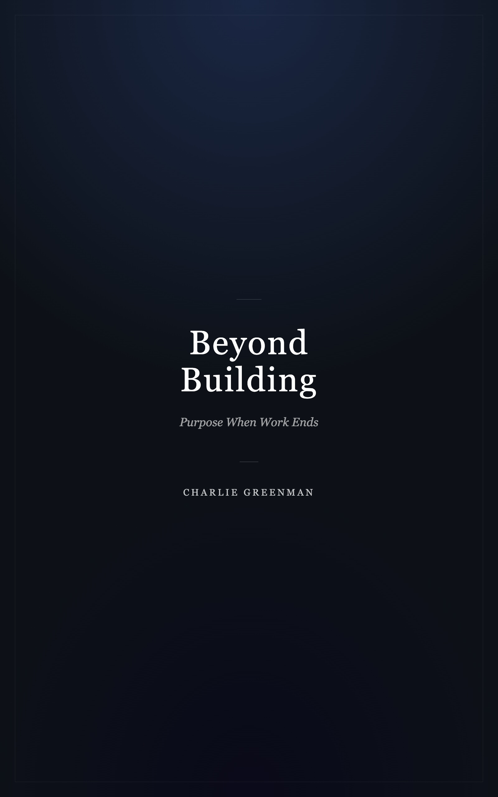

# Beyond Building
### *Purpose When Work Ends*



A book about what human life looks like when ASI and robotics have absorbed the productive economy — and what the most ambitious people do with a world that no longer needs them to build for survival.

**Beyond Building** argues that the collapse of the productive framework is not the end of meaning but its precondition: for the first time in history, civilization has the material foundation to organize itself around depth rather than output. The book traces what this looks like across education, community, economics, and the arc of a human life — and makes the case that the largest building projects in history are still ahead of us, just aimed at different things.

---

## Structure

The book is written in seventeen chapters plus a preface, all in `src/`:

| File | Chapter |
|------|---------|
| `00-preface.md` | Preface: The Builder Who Stopped Building |
| `01` – `12` | Core argument: meaning, identity, contemplation, institutions, love, death |
| `13-the-schools-of-depth.md` | What education becomes when credentials burn |
| `14-the-new-monasteries.md` | Communities organized around being alive |
| `15-the-economics-of-enough.md` | Building economic infrastructure for 8 billion people |
| `16-a-life-in-full.md` | The arc from first breath to last when achievement isn't the plot |
| `17-epilogue.md` | Epilogue |

---

## Build

Generates a print-ready PDF and a Kindle-ready EPUB from the markdown source.

### Requirements

- Node.js 18+
- `npm install`

### Commands

```bash
npm run all       # generate cover image + EPUB + PDF (default)
npm run pdf       # PDF only  (output/beyond-building.pdf)
npm run kindle    # cover + EPUB only  (output/cover.jpg + output/beyond-building.epub)
```

Output lands in `output/` (gitignored).

### Stack

- [`marked`](https://marked.js.org/) — markdown → HTML
- [`puppeteer`](https://pptr.dev/) — HTML → PDF, cover image screenshot
- [`jszip`](https://stuk.github.io/jszip/) — EPUB 3 assembly

---

## License

[CC BY-NC-ND 4.0](LICENSE) — free to read and share, not for commercial use or derivative works.
Copyright © 2026 Charlie Greenman.
